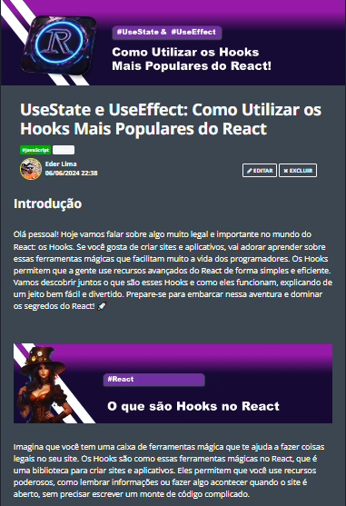

  

# Projeto artigo técnico gerado por I.A.s

Projeto com o objetivo de gerar um artigo técnico com um layout rico, leitura agradável e com foco em promover sua autoridade técnica.

<a href="https://web.dio.me/articles/usestate-e-useeffect-como-utilizar-os-hooks-mais-populares-do-react?back=%2Farticles&page=1&order=oldest" title="View PDF now"> 📕Clique aqui para ler o artigo</a>

## 💻 Tecnologias utilizadas no projeto

- [ChatGPT](https://chat.openai.com/) - para título e conteúdo
- [Lexica.art](https://lexica.art/) - para gerar imagens
- [PowerPoint](https://www.microsoft.com/en/microsoft-365/powerpoint) - Para formatação de banners e Layouts

## 📄 Prompts e ferramentas

ChatGPT：

|   Ação   | prompt                                                                                                                                                                                                                                                                         |
| :------: | ------------------------------------------------------------------------------------------------------------------------------------------------------------------------------------------------------------------------------------------------------------------------------ |
|  título  | Crie 10 headlines para nomes de artigos sobre o assunto React JS - Hooks                                                                                                                                                                                                   |
| conteúdo | 
Comporte-se como um escritor de artigos tech front-end e escreva o artigo atendendo as regras abaixo
{REGRAS}
>No máximo 5 linhas por blocos de explicação
>Explique de maneira informal, como se eu fosse uma criança de 10 anos
>os blocos que serão criados estão abaixo
>O que são Hooks no React
>O que é o Hook UseState e como utilizar
>O que é o Hook useEffect e como utilizar
>faça um call to action para minhas redes sociais |

Lexica.art：

- No léxica utilizamos o acervo público de imagens geradas por outras pessoas, os termos de pesquisa que utilizei durante a gravação do conteúdo foram:

• Steampunk

## ✨ Features

- Conteúdo gerado via ChatGPT
- Imagens do acervo público geradas via Lexica.art

## 📚 Materiais

- prompts utilizados

## 🛠️ Instruções de execução

Utilize os prompts acima nas ferramentas sugeridas para gerar o material base e utilize uma ferramenta de edição de documentos como power point, libreoffice , indesign para diagramação, o passo a passo em vídeo pode ser conferido na plataforma da [DIO](https://dio.me).

---

⌨️ com 💜 por [Eder Lima](https://github.com/EderLimaDev)
